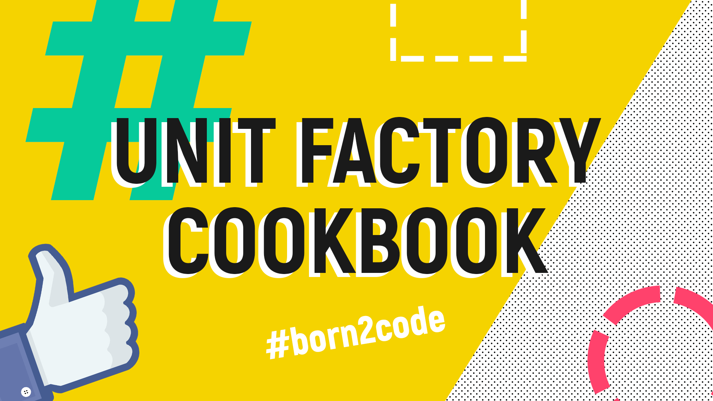
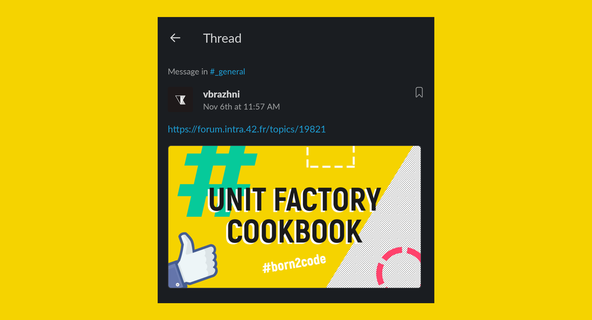
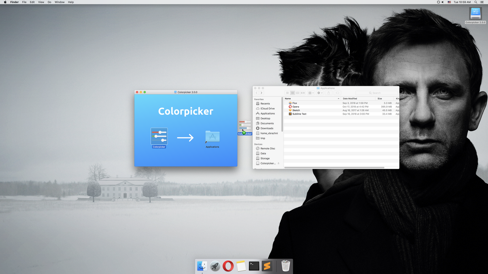
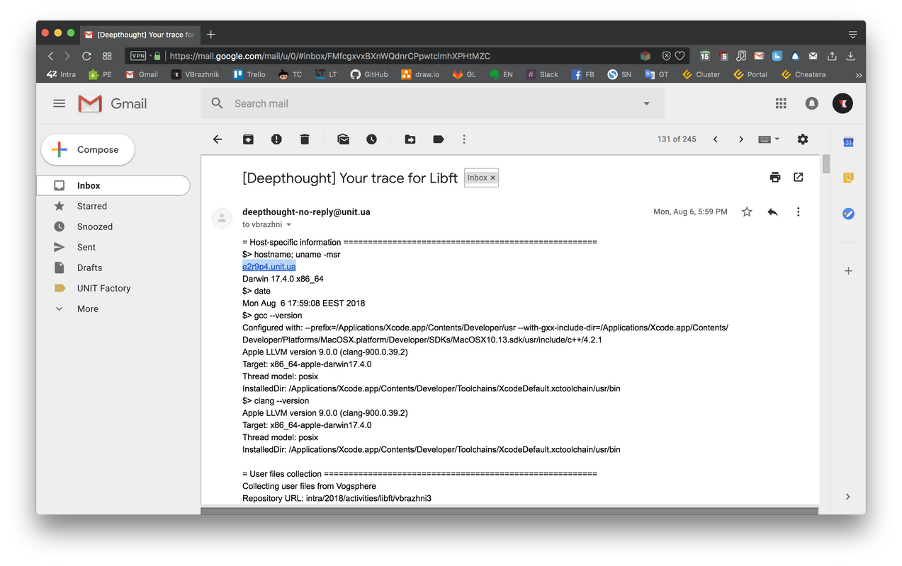

# UNIT Factory Cookbook



> **Disclaimer**
>
> UNIT Factory это школа программирования, открытая по франшизе французской «Школы 42» в Киеве в 2016 году.
>
> В 2017 году я стал студентом этой школы.
>
> А в 2018 воспользовался возможностью стать ментором для нового набора учащихся.
>
> Перед первой встречей с ребятами, которым мне предстояло помогать, я написал следующий текст и опубликовал его на форуме «Школы 42».
>
> 
>
> К сожалению, в следующем году этот форум был закрыт и заменен на Stack Overflow. А несколько месяцев спустя — весной 2020 — и сама школа UNIT Factory прекратила свое существование.
>
> Поэтому темы, затронутые в этом тексте, как и большинство содержащихся в нем ссылок, на данный момент неактуальны.
>
> Это публикация архивной записи. Ее цель — сохранить историю.

Привет!

Перед первой встречей с ребятами, которым мне предстояло помогать в качестве ментора, я решил записать свои мысли и советы, чтобы во время живого разговора ничего не упустить и каждому предоставить одинаковый набор данных.

В результате получился короткий справочник со списком полезных ресурсов, советов и разъяснений, который я решил опубликовать.

Надеюсь, тем, кто также решил попробовать себя в роли ментора, он послужит своеобразным checklist'ом.

А ребята, которые тоже могут поделиться полезной информацией, дополнят этот пост в комментариях.

## Полезные ресурсы

- [unitportal.click](https://unitportal.click/)

Форум студентов UNIT Factory, где собрано огромное количество полезной информации.

Здесь можно найти [советы по выполнению проектов](https://unitportal.click/forum/viewforum.php?f=13&sid=02c7ea6d1e9895da833208bde681aec7) от ребят, которые их уже сдали. А также ссылки на статьи и книги, помогающие понять теоретическую основу задания.

Также здесь доступны [карты кластеров](https://unitportal.click/cluster2/), которые можно просматривать за пределами UNIT Factory.

- [Официальный форум](https://forum.intra.42.fr/)

Полезной информации на этом форуме, к сожалению, немного меньше. А значительная часть постов написана на французском языке.

Но все же и здесь можно найти прекрасные публикации с разъяснениями. В особенности, по проекту `ft_printf`.

- [cheatera.pp.ua](https://cheatera.pp.ua/)

Аналог сайта [cheatera.unit.ua](https://cheatera.unit.ua/), который, в отличие от оригинала, позволяет просматривать рейтинг студентов и статистическую информацию за пределами UF.

А также имеет [прекрасный калькулятор](https://cheatera.pp.ua/calculator/), который поможет рассчитать какой уровень будет получен после выполнения конкретного проекта. Нужно только указать сложность проекта (T1, T2 ...) и предполагаемый балл.

Если не знаете с кем из студентов проконсультироваться во время работы над проектом, то [раздел 42/project](https://cheatera.pp.ua/students/projects/) подскажет, кто его уже выполнил и на какую оценку.

Такой же раздел есть и на [оригинальном сайте](https://cheatera.unit.ua/42/projects).

### Android-приложение «Intra 42»

В Google Play существует [приложение «Intra 42»](https://play.google.com/store/apps/details?id=com.paulvarry.intra42), которым удобней пользоваться, чем официальным сайтом.

## О техническом обеспечении

### Как установить или обновить приложение на iMac?

#### О проблеме

К сожалению, на школьных iMac'ах заблокирован доступ в App Store. А студентам предлагается устанавливать ПО из Managed Software Center.

Вот только в MSC представлены не все необходимые программы, а те, что все же доступны для скачивания, могут иметь старую версию. (Прав администратора, необходимых для обновления ПО, у нас нет)

Кстати, приложение, которое вы скачиваете из MSC, устанавливается в папку `/Applications` на конкретный школьный компьютер, а не на вашу учетную запись.

Поэтому приложения, которыми вы привыкли пользоваться, прийдется устанавливать заново на каждом компьютере, за которым вы еще не сидели. Если этого никто не сделал до вас.

#### Инструкция

Как я уже упомянул, приложения устанавливаются в папку `/Applications`. И, к сожалению, прав на установку в эту directory'ю у нас нет.

Но у нас есть личная папка. Та самая home directory, где хранятся все наши файлы. Её содержимое подгружается на тот школьный iMac, за которым мы логинимся.

И в этой папке есть своя папка `Applications`. В нее можно попасть с помощью следующей команды:

```
open ~/Applications
```

Для этой папки, как и для home directory в целом, у нас есть все необходимые права.

Именно сюда мы можем устанавливать необходимые приложения.

Чтобы получить обновляемое приложение, нужно перетащить его из папки `/Applications` в папку `~/Applications`.

Чтобы установить приложение, нужно:

1. Скачать его образ — файл с расширением `.dmg`

2. Открыть образ

3. Перетащить иконку приложения в папку `~/Applications`



К сожалению, этот способ не универсален. Поскольку некоторые vendor'ы ПО не предоставляют необходимый `.dmg`-образ. Но в большинстве случаев его можно скачать с сайта разработчика.

#### Важно

Тот факт, что мы помещаем приложения в свою личную папку, имеет два важных последствия. Одно — хорошее, а другое — не очень.

**Хорошее последствие**

Поскольку содержимое папки `home_<логин>` подгружается на каждый компьютер, за которым мы логинимся, то приложение в папке `~/Applications` также будет доступно нам на всех iMac'ах.

**Плохое последствие**

Личная папка, где хранятся все наши файлы, ограничена в объеме. Нам доступны всего 5GB.

Данный лимит установлен не из-за жадности бокала или заговора масонов, а чтобы процесс логина не занимал вечность.

Но все же 5GB это довольно мало и стоит следить за тем, какие приложения вы переносите в папку `~/Applications`.

Иначе память быстро закончиться.

### Что делать если закончилась память?

#### Как проверить, что закончилась память?

Для этого есть следующая команда:

```
du -sh ~/
```

Если выведенная в результате сумма близка к 5GB, то вам предстоит работа по удалению нужных и ненужных файлов.

#### Как удалить ненужные файлы?

В вашей личной папке также могут появиться файлы, которые вы не создавали. Это файлы кэша, которые можно смело удалить:

```
rm -rf ~/Library/*42_cache*
```

Если у вас закончилась память, то скорее всего причина именно в этом. Поскольку файлы кэша часто разрастаются до значительного объема.

#### Как найти корень зла?

Иногда свободная память пропадает не из-за файлов кэша. А из-за чего-то другого.

Чтобы выяснить, кто «сожрал» всю память в конкретной папке, можно воспользоваться этой командой:

```
du -sh ./*
```

### Не работает мышка / Завис компьютер

В UNIT Factory находятся 422 компьютера, за которыми каждый день сидят сотни студентов. При таком потоке людей мелкие неполадки в работе техники неизбежны.

Если у вас не работает колесико мышки или повис компьютер, то необходимо:

1. Зайти в Slack
2. Зайти в чат с самим собой
3. В этом чате написать:

```
/marvin broken eXrYpZ
```

X — номер кластера. Y — номер ряда. Z — номер места.

Никого беспокоить не нужно. В том числе не стоит писать в bocal или любой другой диалог.

Просто оставьте репорт marvin'у и пересядьте за другой компьютер. Когда у UNIT Team появится время, проблему устранят.

Исключением из правила «Оставить репорт и пересесть» может быть только событие, требующее немедленного вмешательства:

- iMac завис, но музыка продолжает звучать (Такое уже было)
- iMac горит (Такого еще не было)

В таких случаях можно и нужно побеспокоить bocal.

### Полезные команды marvin'a

Marvin это бот, который много чего знает и много чего умеет.

Ознакомиться со всеми его возможностями можно с помощью команды:

```
/marvin help
```

Среди прочего он подскажет пароль от Wi-Fi и пароль для входа в UNIT.City.

### «Слетающие» настройки

О всех возможных причинах, которые могут вызвать сброс к настройкам «по умолчанию», мне не известно.

Но об одной причине, выявленной с помощью собственных экспериментов, расскажу.

Как известно, время разлогина составляет 42 минуты. Если вас вылогинило, то пока за этот компьютер еще никто не садился, быстро залогинтесь обратно.

В таком случае настройки сохраняться.

Но если вы после такого принудительного вылогина пересядете за другой компьютер или уйдете домой, то ваши настройки сбросятся.

Поэтому, даже если вам уже пора уходить или вы решили пересесть, залогиньтесь и вылогиньтесь на том же iMac'e, чтобы сохранить настройки.

## Обучение

### Что такое blackhole?

Blackhole это такие контрольные точки или, если хотите, мини-дедлайны. Они нужны для того, чтобы дать студенту ориентир, как он двигается по учебной программе.

Чтобы вложиться в каждый из трех blackhole'ов, у вас есть три попытки.

Если вы не успели выполнить условия blackhole'а за первый временной промежуток, то вы получаете вторую попытку и такой же временной отрезок.

При второй неудаче вас ждет разговор с UNIT Team и новая попытка.

После третей неудачи вас ждет разговор с UNIT Team и, возможно, отчисление из школы.

Следить за своей успеваемостью вы можете на специальной странице. Попасть на эту страницу можно нажав на значок книги с закладкой в верхней панели Intra'ы или [пройдя по ссылке](https://profile.intra.42.fr/users/me/quests).

### Проверки

#### Проверочную форму можно почитать заранее

На GitHub'е [есть репозитории](https://github.com/rizkyario/42-corrections), где опубликованы pdf-файлы проверочных форм. С ними можно ознакомиться перед сдачей проекта, чтобы убедиться, что вы ничего не упустили.

«Подгонять» свой проект («Лишь бы на указанных тестах работало...») под проверочную форму нельзя. Ваш проект должен быть корректным в целом, а не только во время работы над приведенными case'ами.

Кстати, в некоторых формах отдельно указано, что оцениваемый проект должен быть проверен на предмет подобной «адаптации».

**В случае применения такого подхода вы получите -42.**

Ссылка на репозиторий с pdf-ками в данном разделе приведена исключительно для удобства. Вы в любом случае ознакомитесь с их содержанием заранее, когда будете проверять других ребят.

#### Несколько проверок на одно время — тяжкий грех

Если вы выступаете в роли проверяемого, то **не назначайте несколько проверок на одно и то же время**. Так делать нельзя.

Если вы проверяющий, то обнаружив на месте еще одного, который уже начал проводить оценивание, скажите, что раз сложилась такая ситуация, вы подойдете чуть позже.

Одновременную проверку вы не проводите!

Относитесь к подобным эксцессам спокойно. Часто проверки накладываются не по вине студента.

Ведь не все проекты можно полноценно проверить за 30 минут. А проверяющие, разведенные во времени с разницей в несколько часов, могут сильно опоздать и прийти в один момент. (Не будьте такими проверяющими, но к другим относитесь с пониманием)

#### Укажите номер телефона в профиле Intra'ы

Иногда случается, что проверяющий задерживается. У него должна быть возможность оперативно вас предупредить об этом. А у вас — возможность быстро его найти.

Также иногда система сбоит и может перестать отображать кто и где сидит.

При таких форс-мажорных обстоятельствах телефонная связь вас выручит.

#### Unit-тесты

Прохождение или fail любого теста на работоспособность проекта, скачанного из интернета или написанного кем-то из знакомых, не является доказательством того, что данный проект правильный или неправильный.

Тесты пишут такие же люди, как и вы. Они могут ошибаться.

Поэтому слепо верить любым тестам, даже самым популярным, не стоит.

Чтобы вынести вердикт, корректный проект или нет, перепроверяйте лично все case'ы, на которые указывает тест.

#### Свою работу нужно защищать

Строгий проверяющий, который понимает суть проекта и может по фактам рассказать, где вы ошиблись, это хорошо.

Не обижайтесь, если он заслужено ставит вам низкий бал. (Вроде, нет причины для обиды, но случаи бывали)

Но не всегда проверяющий бывает прав. Тогда ваша задача переубедить его. **Переубедить аргументами**.

«Вот здесь в subject'е (проверочной форме) указано, что нужно делать так» это аргумент.

«Вот код, который доказывает мою точку зрения. Давай запустим его и посмотрим» это аргумент.

«Мне кто-то говорил, что так нужно делать. Но почему так, я не знаю» это не аргумент.

«У кого-то в репозитории на Github так же сделано» это не аргумент.

#### «У меня все работает»

_Внимание! В этом разделе приведена информация, опирающаяся на факты, но не имеющая стопроцентного подтверждения._

Довольно часто в канал bocal'а приходят сообщения следующего содержания: «У меня на iMac'е все работает. Это у вас на сервере проблема».

Так вот. На сервере нет проблемы. Если вы посмотрите на пришедшие вам trace'ы, то вверху будет указано какой компьютер проверял ваш код.



Еще раз. Ваш проект проверяется на таком же iMac'е. В общем, в 99% процентах случаев «дело в тебе», хотя по началу может казаться, что это не так.

## Разное

### Нужна справка, что я учусь в UNIT Factory

На вашей странице в Intra'e есть кнопка «School record». Она сделает все необходимое.

### Я видел автобус с надписью «UNIT»

Мы тоже его видели.

От метро «Дорогожичи» до UNIT.City действительно курсирует специальный автобус.

С его расписанием можно ознакомиться [на официальном сайте UNIT.City](https://unit.city/shuttle-bus/).
